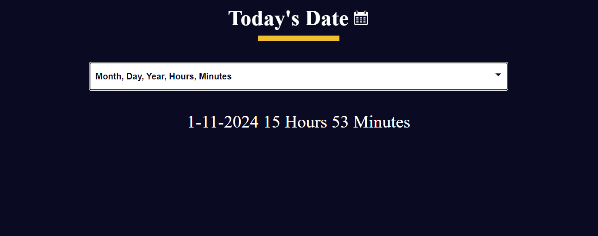

# Date_Formater 

 # Project Description
 * Date Formater application that allows users to input a date in a given format and view the formatted date in a different format. It is built using HTML for structure, CSS for styling, and JavaScript for handling the date formatting functionality.
1. User-friendly Interface: Clear and intuitive design for easy interaction.
2. Input Field: A text input field for users to enter a date in a specified format.
3. Format Selection: Dropdown menu or input options for users to select the desired output date format.
4. Real-time Formatting: JavaScript code that formats the entered date in real-time based on user input.
5. Responsive Design: Ensures a seamless experience on various devices.

# Technologies Used:
* HTML
* CSS
* JavaScript
# Usage:
Clone the repository to your local machine.
* git clone https://github.com/kumarshivam04203/Date-Formater.git
* Open the index.html file in a web browser.
* Enter a date in the specified format and select the desired output format.
* View the formatted date in real-time.
